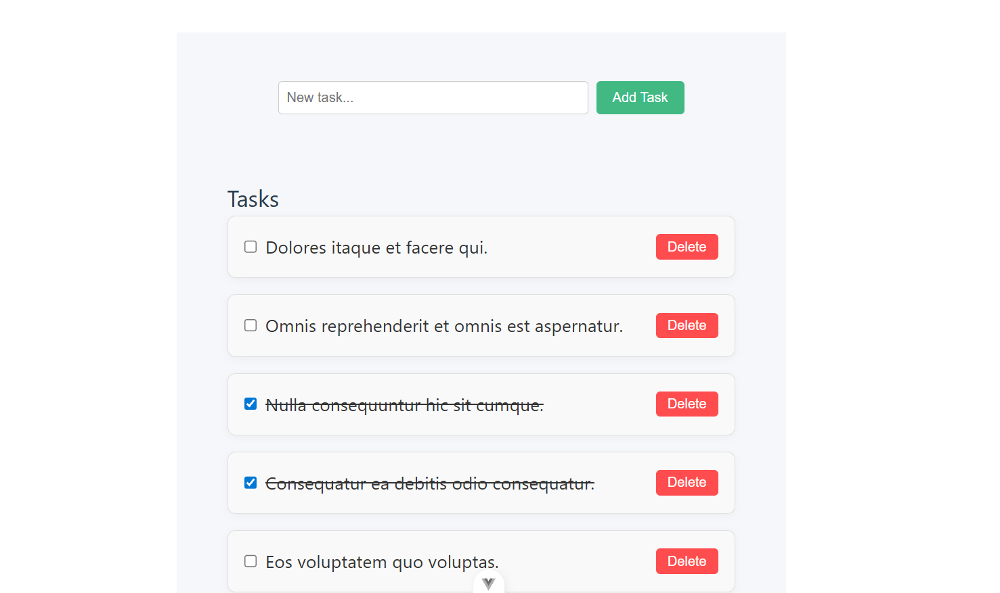

# Vue Task App

A simple and modern task management application built with Vue 3 and TypeScript.  
You can add, complete, and delete tasks with a clean UI and persistent backend.

## Features

- Add new tasks
- Mark tasks as completed (with checkbox)
- Delete tasks (with confirmation)
- Tasks are fetched from and synced with a backend API
- Responsive and centered layout

## Preview



## Project Setup

```bash
# Install dependencies
npm install

# Run the development server
npm run dev

# Build for production
npm run build
```

## API

This app expects a backend API with the following endpoints:

- `GET /api/tasks` — fetch all tasks
- `POST /api/tasks` — create a new task (`{ name, is_completed }`)
- `PUT /api/tasks/:id` — update a task
- `DELETE /api/tasks/:id` — delete a task

## Folder Structure

```
src/
  components/
    TaskForm.vue
    Tasks.vue
  api/
    taskApi.ts
  assets/
    main.css
  App.vue
  main.ts
preview.png
```

## License

MIT